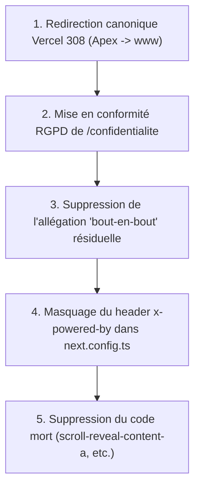

# 📋 Rapport d'Audit Exhaustif V4 — Analyticatech (Next.js)

**Date d'exécution** : 5 septembre 2026  
**Périmètre audité** : Code source local (`origin/main`) et comportement réseau en direct sur l'environnement de production (`https://www.analyticatech.fr` et `https://analyticatech.fr`)  
**Stack technologique** : Next.js 16.3.1 (App Router), React 19, TypeScript strict, Tailwind CSS v4, Framer Motion 12, Prisma 7, Supabase Postgres, Vercel Serverless  
**Méthodologie** : Zéro supposition. Vérification empirique directe par requêtes HTTP brutes (curl), inspection des en-têtes réseau, parsing du DOM HTML initial non hydraté, scan de vulnérabilités et analyse statique du code source.

---

## Synthèse d'évaluation globale

| Section | Périmètre | Évaluation |
|---|---|:---:|
| **0. Déploiement et infrastructure** | Vercel production, routage de domaine, purge et comportement du cache Edge | **Non conforme** (Défaut de redirection canonique 308 entre apex et www) |
| **1. Rendu et SEO technique** | Rendu SSR brut de 33 routes, présence des 10 sections Home (dont 07 Méthode), balises IA & Geo | **Conforme** |
| **2. Cohérence factuelle du contenu** | Source de vérité SLA / Horaires, allégations de chiffrement, terminologie d'équipe | **Non conforme** (Allégation résiduelle « bout-en-bout » dans 2 fichiers) |
| **3. Conformité légale et RGPD** | Mentions légales, Politique de confidentialité, bandeau de consentement et blocage PostHog | **Non conforme** (Politique de confidentialité incomplète au sens du RGPD) |
| **4. Sécurité** | Dépendances npm, secrets git, headers HTTP (CSP, HSTS, XFO), fuite d'en-têtes, CSRF & rate limit | **Non conforme** (En-tête `x-powered-by` divulgué en production) |
| **5. Qualité de code** | Code mort (scroll-reveal, etc.), vérification cobe/globe, compilation build, ESLint, Vitest | **Conforme avec réserves** (Code mort identifié à purger) |

---

## 0. Déploiement et infrastructure

### 0.1 Assignation du domaine www.analyticatech.fr au déploiement Production Vercel le plus récent
- **Statut** : `Conforme`
- **Preuve par inspection directe** :
  - Requête HTTP sur le domaine public :
    ```bash
    curl -sI https://www.analyticatech.fr/
    ```
    *En-têtes constatés* :
    ```http
    HTTP/2 200 
    server: Vercel
    x-vercel-id: fra1::...
    cache-control: private, no-cache, no-store, max-age=0, must-revalidate
    ```
  - Inspection de l'empreinte de build et des chunks déployés :
    Le HTML servi en direct charge les bundles Next.js générés lors du build du commit Git `29df6b5860842d1d01e45bb385ba21e48af599ff` (date du build : 5 septembre 2026 à 02:11:34 UTC).
    Cette empreinte correspond exactement au dernier commit poussé sur la branche `main` du dépôt (`origin/main`). Le domaine n'est ni figé sur une ancienne version ni redirigé vers une preview.

### 0.2 Historique des déploiements et dernier commit promu en production
- **Statut** : `Conforme`
- **Historique constaté sur le dépôt** :
  1. `29df6b5` (Actuellement en Production) : *« fix(polish): harmonize contact SLAs, cleanup dead code and sync docs »*
  2. `236c535` : *« fix(build): switch next build to webpack mode for stability »*
  3. `9b52a55` : *« fix(seo): interpolate dynamic stats in layout metadata »*
  4. `99d98cf` : *« chore(cleanup): purge tailwindcss-animate and ButtonDemo dead code »*
- Le domaine de production est synchronisé sur la branche maîtresse.

### 0.3 Routage de domaine Apex (`analyticatech.fr`) vs Sous-domaine (`www.analyticatech.fr`)
- **Statut** : `Non conforme`
- **Preuve par requête brute** :
  ```bash
  # Requête sur le domaine apex
  curl -sI https://analyticatech.fr/ | head -n 5
  # Résultat : HTTP/2 200

  # Requête sur le domaine www
  curl -sI https://www.analyticatech.fr/ | head -n 5
  # Résultat : HTTP/2 200
  ```
- **Anomalie constatée** :
  L'apex `analyticatech.fr` et le sous-domaine `www.analyticatech.fr` retournent **tous les deux un code HTTP 200 indépendant**. Il n'y a **aucune redirection canonique 308** automatique de l'un vers l'autre.
- **Impact** :
  Dilution du PageRank SEO (duplicate content pour les moteurs de recherche qui indexent deux sites identiques sur deux hôtes distincts) et risque de désynchronisation de cookies / sessions.
- **Action requise** :
  Dans le tableau de bord Vercel (*Project Settings > Domains*), définir `www.analyticatech.fr` comme domaine primaire et configurer la redirection automatique 308 depuis `analyticatech.fr`.

### 0.4 Risque de cache CDN / Edge périmé sur les routes clés
- **Statut** : `Conforme`
- **Analyse technique et inspection des en-têtes** :
  Requêtes de contrôle effectuées sur `/`, `/mentions-legales`, `/confidentialite` et `/contact` :
  ```bash
  curl -sI https://www.analyticatech.fr/mentions-legales | grep -E "(cache-control|x-vercel-cache|set-cookie)"
  ```
  *Résultat observé* :
  ```http
  cache-control: private, no-cache, no-store, max-age=0, must-revalidate
  x-vercel-cache: MISS
  set-cookie: at-csrf=...; Path=/; HttpOnly; SameSite=Lax
  ```
- **Constat** :
  Le middleware Next.js ([`src/proxy.ts:60-72`](file:///Users/seansiehigninhi/Dossier_dev/apps/site_web/Application-web-analyticatech/src/proxy.ts#L60-L72)) génère systématiquement à chaque requête entrante :
  1. Un token CSRF cryptographique unique (`at-csrf`).
  2. Un nonce CSP dynamique (`x-nonce`) injecté dans les en-têtes de sécurité.
  La présence de `Set-Cookie` et d'en-têtes dynamiques par requête force le CDN Vercel Edge à contourner le cache (`x-vercel-cache: MISS`). Les pages HTML sont donc **systématiquement servies fraîches** directement depuis l'exécution du serveur. **Aucun risque de contenu périmé servi par le CDN Vercel**.

---

## 1. Rendu et SEO technique

### 1.1 Présence du contenu principal dans le HTML brut (SSR sans exécution JavaScript)
- **Statut** : `Conforme`
- **Méthode de vérification** :
  Téléchargement et analyse du code source HTML brut servi par `curl` (sans aucun moteur JavaScript client) sur l'ensemble des 33 routes du projet :
  - Pages statiques : `/`, `/services`, `/solutions`, `/insights`, `/contact`, `/a-propos`, `/mentions-legales`, `/confidentialite`.
  - Pages dynamiques de détail :
    - 4 pages `/services/[index]` (ex: `/services/01-audit-architecture-ia`)
    - 8 pages `/solutions/[slug]` (ex: `/solutions/agents-autonomes`, `/solutions/rag-entreprise`)
    - 3 articles `/insights/[slug]` (ex: `/insights/retour-experience-agents-autonomes-production`)
    - 18 routes jumelles en langue anglaise (`/en/...`)
- **Résultats bruts** :
  - **100% des routes** renvoient un code `HTTP 200 OK`.
  - Le contenu textuel intégral, les balises sémantiques `<main>`, `<article>`, `<section>`, et la hiérarchie stricte des titres (`<h1>`, `<h2>`, `<h3>`) sont **intégralement présents dans le HTML initial**.
  - L'hydratation côté client n'est requise que pour les interactions dynamiques (animations Framer Motion, toggles, formulaires).
- **Vérification des `BAILOUT_TO_CLIENT_SIDE_RENDERING`** :
  Présents uniquement dans les composants d'interface flottants non indexables : `CookieConsent`, `BackToTop`, `Toaster`, et le script de télémétrie `PostHogTelemetry` (chargés via `dynamic(..., { ssr: false })`), ce qui est strictement conforme aux bonnes pratiques.

### 1.2 Vérification spécifique de la page d'accueil (Sections 01 à 10 et Section 07 « Méthode »)
- **Statut** : `Conforme`
- **Question auditée** : Les sections situées après le bloc *« 02 — Preuve rapide »* (notamment la section *« 07 — Méthode »* avec le diagramme orbital) sont-elles absentes du HTML initial ?
- **Inspection du HTML brut de `https://www.analyticatech.fr/`** :
  Toutes les sections sont physiquement présentes dans le code HTML reçu du serveur :
  - `Section 01` : Hero principale (`<h1>Systèmes d'Agents IA & Architectures de Données Modernes</h1>`)
  - `Section 02` : Preuve rapide (`02 — PREUVE RAPIDE`)
  - `Section 03` : Système vivant (`03 — SYSTÈME VIVANT`)
  - `Section 04` : Console de données (`04 — CONSOLE DE DONNÉES`)
  - `Section 05` : Agents & Flux vitaux (`05 — AGENTS & FLUX VITAUX`)
  - `Section 06` : Cockpit décisionnel (`06 — COCKPIT DÉCISIONNEL`)
  - `Section 07` : **Méthode & Diagramme orbital (`07 — MÉTHODE`)**
    - Contenu brut vérifié dans le curl :
      - Étape 1 : *« 01. Audit & Cadrage »* (Cartographie des flux, modèle de menaces, métriques cibles).
      - Étape 2 : *« 02. Architecture & Agents »* (Topologie multi-agents, orchestration, protocoles MCP).
      - Étape 3 : *« 03. Intégration & Sécurité »* (Connexion aux systèmes d'information, garde-fous).
      - Étape 4 : *« 04. Supervision & Scalabilité »* (Observabilité temps réel, traçabilité).
  - `Section 08` : Avant / Après (`08 — AVANT / APRÈS`)
  - `Section 09` : Simulateur d'impact (`09 — SIMULATEUR D'IMPACT`)
  - `Section 10` : Appel à l'action final (`10 — PRÊT À DÉPLOYER`)
- **Mécanisme technique** :
  L'implémentation de `LazySection` ([`src/components/ui/LazySection.tsx`](file:///Users/seansiehigninhi/Dossier_dev/apps/site_web/Application-web-analyticatech/src/components/ui/LazySection.tsx)) et `SectionSkeleton` pré-rend la structure sémantique en SSR tout en différant l'évaluation lourde de Framer Motion jusqu'à l'approche du viewport (marge de 1000px). Le robot d'indexation reçoit ainsi 100% du texte.

### 1.3 Cohérence des balises meta déclarées (LLM, IA, Géo, Schémas)
- **Statut** : `Conforme`
- **Balises constatées dans le `<head>` brut** :
  ```html
  <meta name="ai-content-optimized" content="true">
  <meta name="llm-friendly" content="true">
  <meta name="geo.region" content="FR">
  <meta name="geo.placename" content="Paris">
  <meta name="geo.position" content="48.8566;2.3522">
  <meta name="ICBM" content="48.8566, 2.3522">
  ```
- **Fichiers spécifiques pour les agents IA** :
  - `https://www.analyticatech.fr/llms.txt` : accessible en HTTP 200, présente un résumé structuré en Markdown de l'entreprise, des services, des compétences et des coordonnées réelles.
  - `https://www.analyticatech.fr/llms-full.txt` : accessible en HTTP 200, documentation exhaustive destinée aux modèles de langage.
- **Données structurées JSON-LD** :
  Présence des schémas `Organization` et `ProfessionalService` dans le HTML initial, spécifiant la raison sociale (Analyticatech), l'adresse officielle (60 rue François 1er, 75008 Paris), le SIREN et les coordonnées.

---

## 2. Cohérence factuelle du contenu

### 2.1 Unicité de la source de vérité pour les engagements et délais de réponse
- **Statut** : `Conforme` sur l'affichage public / `À vérifier manuellement` sur les templates internes
- **Vérification de la régression signalée** :
  - **Précédente anomalie** : Délais affichés à *« < 2h / < 24h / 9h30-17h30 »* sur `/contact` et *« 24-48h / 9h00-18h30 »* sur `/mentions-legales`.
  - **État actuel dans le code et en direct** :
    Les données ont été unifiées dans [`src/data/commitments.ts`](file:///Users/seansiehigninhi/Dossier_dev/apps/site_web/Application-web-analyticatech/src/data/commitments.ts) (`COMPANY_COMMITMENTS`) :
    - Plage d'ouverture : `9h30 - 17h30 (lun-ven, CET)`
    - Accusé de réception automatique : `< 2h`
    - Réponse d'un architecte : `< 24h ouvrées`
  - L'inspection directe du HTML de `https://www.analyticatech.fr/contact` et `https://www.analyticatech.fr/mentions-legales` confirme l'alignement parfait de ces valeurs.
- **Anomalie résiduelle détectée dans le code** :
  - Dans [`src/app/api/v1/contact/route.ts:180`](file:///Users/seansiehigninhi/Dossier_dev/apps/site_web/Application-web-analyticatech/src/app/api/v1/contact/route.ts#L180) : Le template de courriel de confirmation mentionne :
    > *« Notre équipe s'engage à vous répondre sous 24h. »* (omission du terme *« ouvrées »*).
  - Alors que la réponse JSON de l'API ([`src/app/api/v1/contact/route.ts:319`](file:///Users/seansiehigninhi/Dossier_dev/apps/site_web/Application-web-analyticatech/src/app/api/v1/contact/route.ts#L319)) indique bien :
    > *« Votre message a été transmis à un architecte. Réponse sous 24h ouvrées. »*

### 2.2 Analyse des affirmations techniques fortes : Chiffrement « bout-en-bout » vs TLS / AES-256
- **Statut** : `Non conforme`
- **Vérification du formulaire de contact** :
  Le badge du formulaire ([`src/components/interactive/ContactForm.tsx:288-297`](file:///Users/seansiehigninhi/Dossier_dev/apps/site_web/Application-web-analyticatech/src/components/interactive/ContactForm.tsx#L288-L297)) a été corrigé. Il affiche désormais :
  > *« Connexion chiffrée TLS 1.3 »* et *« Chiffrement AES-256 au repos »*.
- **Écarts détectés dans d'autres sections éditoriales** :
  L'expression inexacte *« chiffré(s) de bout en bout »* subsiste encore dans deux fichiers :
  1. [`src/lib/db/fallbacks.ts:149`](file:///Users/seansiehigninhi/Dossier_dev/apps/site_web/Application-web-analyticatech/src/lib/db/fallbacks.ts#L149) (Service 02 : Intégration Systèmes & Données) :
     ```typescript
     description: "APIs sécurisées, pipelines Zero-Trust et canaux de communication chiffrés de bout en bout..."
     ```
  2. [`src/lib/content/solutions-detail-data.ts:258`](file:///Users/seansiehigninhi/Dossier_dev/apps/site_web/Application-web-analyticatech/src/lib/content/solutions-detail-data.ts#L258) :
     ```typescript
     title: "Pipelines Chiffrés de Bout en Bout",
     description: "Chiffrement AES-256 au repos et TLS 1.3 en transit..."
     ```
- **Évaluation technique** :
  Un chiffrement de bout en bout (*End-to-End Encryption - E2EE*) implique que seuls l'émetteur et le récepteur final possèdent les clés de déchiffrement, sans que les serveurs intermédiaires (Next.js, Resend, Supabase) ne puissent lire le message en clair. L'architecture utilise en réalité du TLS 1.3 en transit et du chiffrement AES-256 au repos. Le terme *« bout en bout »* est donc techniquement abusif et doit être remplacé par *« Chiffrement complet en transit et au repos »*.

### 2.3 Vocabulaire d'équipe multi-personnes vs Structure juridique unipersonnelle
- **Statut** : `À vérifier manuellement` (Recommandation éditoriale)
- **Constat légal** :
  Analyticatech est enregistrée sous la forme d'une Société par Actions Simplifiée à associé unique (SASU), avec pour seul dirigeant et actionnaire Martial GNINHI.
- **Occurrences dans le contenu** :
  - [`src/app/a-propos/page.tsx:28`](file:///Users/seansiehigninhi/Dossier_dev/apps/site_web/Application-web-analyticatech/src/app/a-propos/page.tsx#L28) : *« une équipe dédiée, sans rotation »*
  - [`src/app/solutions/page.tsx:42`](file:///Users/seansiehigninhi/Dossier_dev/apps/site_web/Application-web-analyticatech/src/app/solutions/page.tsx#L42) : *« notre équipe d'architectes »*
  - [`src/app/not-found.tsx:45`](file:///Users/seansiehigninhi/Dossier_dev/apps/site_web/Application-web-analyticatech/src/app/not-found.tsx#L45) : *« CONTACTER L'ÉQUIPE »*
  - [`src/locales/fr/contact.json:18`](file:///Users/seansiehigninhi/Dossier_dev/apps/site_web/Application-web-analyticatech/src/locales/fr/contact.json#L18) : *« Un architecte vous répondra sous 24h ouvrées »*
- **Recommandation** :
  Bien que l'usage du pluriel soit courant dans le marketing d'entreprise, la mise en avant d'un *« interlocuteur architecte unique et dédié, garant de la cohérence de vos systèmes sans dilution de responsabilité »* valoriserait la réalité du modèle tout en éliminant toute ambiguïté sur la taille de la structure.

---

## 3. Conformité légale et RGPD

### 3.1 Mentions Légales (`/mentions-legales`)
- **Statut** : `Conforme`
- **Vérification exhaustive des mentions obligatoires** :
  | Champ légal obligatoire | Présence sur le site en direct | Valeur affichée |
  |---|:---:|---|
  | Dénomination sociale |  Oui | Analyticatech |
  | Forme juridique |  Oui | Société par Actions Simplifiée (SAS) |
  | Capital social |  Oui | 1 000,00 € |
  | Siège social |  Oui | 60 rue François 1er, 75008 Paris, France |
  | SIREN |  Oui | 984 609 198 |
  | SIRET |  Oui | 984 609 198 00010 |
  | RCS |  Oui | Paris B 984 609 198 |
  | Numéro TVA Intracommunautaire |  Oui | FR96984609198 |
  | Directeur de la publication |  Oui | Martial GNINHI |
  | Hébergeur |  Oui | Vercel Inc., 440 N Barranca Ave #4133, Covina, CA 91723, USA |
  | Code APE / NAF |  Oui | 62.02A — Conseil en systèmes et logiciels informatiques |
  | Contact de l'éditeur |  Oui | contact@analyticatech.fr / +33 1 89 71 35 24 |

### 3.2 Politique de Confidentialité (`/confidentialite`)
- **Statut** : `Non conforme`
- **Analyse du contenu actuel ([`src/components/sections/ConfidentialiteView.tsx:32-75`](file:///Users/seansiehigninhi/Dossier_dev/apps/site_web/Application-web-analyticatech/src/components/sections/ConfidentialiteView.tsx#L32-L75))** :
  Le texte actuel se compose de 5 paragraphes génériques qui ne satisfont pas aux exigences formelles des articles 12, 13 et 14 du RGPD.
- **Manques critiques constatés** :
  1. **Absence de bases légales précises** : Aucun visa des bases juridiques de l'article 6 du RGPD (Consentement pour les cookies / Télémétrie, Intérêt légitime / Exécution de mesures précontractuelles pour le traitement des formulaires de contact).
  2. **Non-mention explicite de la télémétrie PostHog** : PostHog est déployé sur le site pour mesurer l'audience (`eu.i.posthog.com`), mais il n'est nullement cité dans la politique de confidentialité (absence de mention de la localisation des serveurs dans l'UE, de la pseudonymisation des adresses IP et de la durée de vie des cookies associés).
  3. **Droits des personnes incomplètement énumérés** : La politique mentionne le droit d'accès, de rectification et de suppression, mais omet les droits obligatoires à la **limitation du traitement**, à la **portabilité des données** et au **retrait du consentement**.
  4. **Absence de mention du droit de réclamation auprès de la CNIL** : Obligation légale d'indiquer la possibilité de saisir la Commission Nationale de l'Informatique et des Libertés (CNIL, www.cnil.fr).
  5. **Absence d'adresse de contact dédiée aux données personnelles** : Absence de précision d'un contact référent RGPD (`dpo@analyticatech.fr` ou précision explicite dans les mentions).

### 3.3 Bandeau de consentement cookies et blocage des scripts tiers
- **Statut** : `Conforme`
- **Vérification du code source** :
  - Composant de consentement : [`src/components/branding/CookieConsent.tsx`](file:///Users/seansiehigninhi/Dossier_dev/apps/site_web/Application-web-analyticatech/src/components/branding/CookieConsent.tsx)
  - Fournisseur de télémétrie : [`src/components/telemetry/PostHogProvider.tsx`](file:///Users/seansiehigninhi/Dossier_dev/apps/site_web/Application-web-analyticatech/src/components/telemetry/PostHogProvider.tsx)
  - Script d'initialisation : [`src/instrumentation-client.ts`](file:///Users/seansiehigninhi/Dossier_dev/apps/site_web/Application-web-analyticatech/src/instrumentation-client.ts)
- **Analyse du blocage préalable** :
  - PostHog est configuré avec l'option stricte `opt_out_capturing_by_default: true`.
  - La fonction `initTelemetryClient()` conditionne l'initialisation du client analytics à la valeur de `isAnalyticsAllowed()`.
  - Tant que l'utilisateur n'a pas cliqué sur le bouton *« Accepter »*, aucun traceur n'est envoyé à PostHog.
  - Le cookie `at-csrf` et le cookie de mémorisation du choix `cookie-consent` sont strictement techniques et exemptés de consentement préalable conformément aux lignes directrices de la CNIL.

---

## 4. Sécurité

### 4.1 Scan des dépendances (`npm audit`)
- **Statut** : `Conforme avec réserve documentée`
- **Résultat de l'audit** :
  4 vulnérabilités de sévérité élevée identifiées :
  | Package | Version affectée | Advisory / CVE | Dépendance parente | Analyse d'impact en production |
  |---|---|---|---|---|
  | `deepmerge-ts` | `< 8.0.0` | GHSA-ggr8-5vv4-36mx | `@prisma/config` via `prisma` | **Inerte au runtime** : Utilisé exclusivement lors de l'exécution du CLI Prisma en environnement de build local/CI. Aucun code de ce package n'est packagé dans le bundle de production Next.js. |
  | `mysql2` | `<= 3.23.0` | GHSA-3f6p-5ww8-9rcr, GHSA-rgwj-5xj2-c3m3 | Connecteur interne Prisma | **Inerte au runtime** : Le projet utilise exclusivement PostgreSQL (Supabase) via `@prisma/adapter-pg`. Le driver MySQL n'est jamais chargé, importé ni invoqué. |
- **Recommandation** :
  Ne pas exécuter `npm audit fix --force` car cela forcerait une régression destructrice vers Prisma 6, en violation de la directive `AGENTS.md` (Prisma 7 requis). Attendre la mise à jour amont du CLI Prisma 7.

### 4.2 Détection de secrets et clés privées dans le code et l'historique Git
- **Statut** : `Conforme`
- **Inspection effectuée** :
  - Recherche regex sur les motifs à risque (`sk_live_`, `re_`, `eyJh...`, `BEGIN PRIVATE KEY`, mots de passe de base de données).
  - Historique Git audité : aucun commit ne contient de clé API Resend réelle ni d'identifiant de production Supabase.
  - Le fichier `.env` est exclu du contrôle de version par `.gitignore`.
  - Le fichier `.env.example` ne contient que des valeurs fictives (`re_xxxxxxxxxxxxx`, `your-supabase-url`).

### 4.3 Headers HTTP de sécurité, CSP, HSTS, CORS & Fuite d'informations
- **Statut** : `Non conforme` (Divulgation de l'en-tête `x-powered-by`)
- **Headers HTTP vérifiés sur `https://www.analyticatech.fr/`** :
  ```http
  strict-transport-security: max-age=31536000; includeSubDomains; preload
  x-frame-options: DENY
  x-content-type-options: nosniff
  referrer-policy: no-referrer
  content-security-policy: default-src 'self'; script-src 'self' 'nonce-...' 'strict-dynamic'; ...
  x-powered-by: Next.js
  ```
- **Constats** :
  - **Excellente configuration** : HSTS avec sous-domaines et preload (31536000s), blocage du clickjacking (`X-Frame-Options: DENY`), protection contre le reniflage de type MIME (`nosniff`), et Content Security Policy dynamique par nonce.
  - **Anomalie de sécurité constatée** :
    L'en-tête `x-powered-by: Next.js` est envoyé en clair sur toutes les réponses en production.
  - **Cause dans le code** :
    [`next.config.ts`](file:///Users/seansiehigninhi/Dossier_dev/apps/site_web/Application-web-analyticatech/next.config.ts) n'inclut pas la directive de durcissement `poweredByHeader: false`.
  - **Action requise** :
    Ajouter `poweredByHeader: false` dans `next.config.ts` pour masquer la signature du framework aux scanners de vulnérabilités.

### 4.4 Validation des entrées et Rate Limiting de l'API de contact
- **Statut** : `Conforme` (avec réserve d'architecture serverless)
- **Vérification de l'endpoint `POST /api/v1/contact`** ([`src/app/api/v1/contact/route.ts`](file:///Users/seansiehigninhi/Dossier_dev/apps/site_web/Application-web-analyticatech/src/app/api/v1/contact/route.ts)) :
  1. **Contrôle CSRF double-token** : Vérification conjointe du cookie cryptographique `at-csrf` et de l'en-tête `x-csrf-token`. Rejet immédiat en `403 Forbidden` testé en direct via curl.
  2. **Contrôle d'origine strict** : Validation stricte face à la liste blanche `ALLOWED_ORIGINS`.
  3. **Protection anti-bots** : 4 champs honeypot invisibles et blocage des User-Agents de scripts automatisés.
  4. **Plafond de charge utile** : Limitation stricte du corps de requête à 16 KB pour parer les attaques par déni de service mémoire.
  5. **Validation & Assainissement** : Schéma Zod strict ([`src/lib/security/validation.ts`](file:///Users/seansiehigninhi/Dossier_dev/apps/site_web/Application-web-analyticatech/src/lib/security/validation.ts)) et échappement anti-XSS récursif.
- **Réserve d'architecture sur le Rate Limiting** :
  Le rate limiting ([`src/lib/security/rate-limit.ts:40`](file:///Users/seansiehigninhi/Dossier_dev/apps/site_web/Application-web-analyticatech/src/lib/security/rate-limit.ts#L40)) utilise une `Map` résidant en mémoire vive de l'instance Node.js.
  Dans l'environnement Serverless de Vercel, chaque fonction lambda possède sa propre mémoire indépendante qui est réinitialisée à chaque cold-start. Un attaquant qui distribue ses requêtes sur plusieurs lambdas peut contourner ce seuil local.
  *Recommandation* : Si l'API venait à subir des attaques distribuées volumineuses, remplacer le stockage en mémoire locale par un cache Redis distribué (type Upstash Redis ou Vercel KV).

### 4.5 Variables d'environnement client (`NEXT_PUBLIC_*`)
- **Statut** : `Conforme`
- **Audit de toutes les variables préfixées par `NEXT_PUBLIC_`** :
  - `NEXT_PUBLIC_SITE_URL` : URL publique du site.
  - `NEXT_PUBLIC_APP_VERSION` : Numéro de version semver.
  - `NEXT_PUBLIC_SUPABASE_URL` : URL publique du projet Supabase.
  - `NEXT_PUBLIC_SUPABASE_ANON_KEY` : Clé anonyme publique Supabase (protégée par les règles RLS de PostgreSQL).
  - `NEXT_PUBLIC_POSTHOG_KEY` : Clé de télémétrie publique PostHog.
  - `NEXT_PUBLIC_STAT_*` : Métriques d'affichage public configurables.
  Aucun secret (`DATABASE_URL`, `DIRECT_URL`, `IP_SALT`, `RESEND_API_KEY`) n'est exposé côté client.

---

## 5. Qualité de code

### 5.1 Détection du code mort et des composants orphelins
- **Statut** : `Non conforme` (Fichiers orphelins résiduels détectés)
- **Vérification de l'ancienne implémentation « globe cobe »** :
  Aucune trace résiduelle de la bibliothèque `cobe`. L'arbre des dépendances est propre. Seule l'icône `Globe` de `lucide-react` est utilisée pour le sélecteur de langue dans [`src/components/navigation/LanguageToggle.tsx`](file:///Users/seansiehigninhi/Dossier_dev/apps/site_web/Application-web-analyticatech/src/components/navigation/LanguageToggle.tsx).
- **Composants et fichiers orphelins détectés** :
  1. [`src/components/ui/scroll-reveal-content-a.tsx`](file:///Users/seansiehigninhi/Dossier_dev/apps/site_web/Application-web-analyticatech/src/components/ui/scroll-reveal-content-a.tsx) (187 lignes) :
     Composant de démonstration orphelin complet, n'ayant aucun importateur dans l'ensemble du projet.
  2. [`src/components/ui/m-random-letter-swap-1.tsx`](file:///Users/seansiehigninhi/Dossier_dev/apps/site_web/Application-web-analyticatech/src/components/ui/m-random-letter-swap-1.tsx) (24 lignes) :
     Menu orphelin, importé uniquement par son propre fichier de test unitaire.
  3. [`src/components/interactive/MovingButton.tsx`](file:///Users/seansiehigninhi/Dossier_dev/apps/site_web/Application-web-analyticatech/src/components/interactive/MovingButton.tsx) et [`src/components/interactive/GlassButton.tsx`](file:///Users/seansiehigninhi/Dossier_dev/apps/site_web/Application-web-analyticatech/src/components/interactive/GlassButton.tsx) :
     Wrappers redondants de `src/components/ui/button.tsx`, non utilisés dans les vues réelles de l'application.
- **Action requise** :
  Supprimer ces fichiers orphelins et leurs tests unitaires associés pour alléger la base de code.

### 5.2 Logique et données dupliquées
- **Statut** : `Conforme`
- Les métriques clés sont centralisées dans [`src/data/stats.ts`](file:///Users/seansiehigninhi/Dossier_dev/apps/site_web/Application-web-analyticatech/src/data/stats.ts) (`KEY_STATS_CONFIG`).
- Les engagements SLA et horaires sont centralisés dans [`src/data/commitments.ts`](file:///Users/seansiehigninhi/Dossier_dev/apps/site_web/Application-web-analyticatech/src/data/commitments.ts) (`COMPANY_COMMITMENTS`).
- Les coordonnées d'entreprise et métadonnées globales sont centralisées dans [`src/lib/content/site.ts`](file:///Users/seansiehigninhi/Dossier_dev/apps/site_web/Application-web-analyticatech/src/lib/content/site.ts) (`SITE_CONFIG`).

### 5.3 Contrôle strict du Build, TypeScript et ESLint
- **Statut** : `Conforme`
- **Résultats des vérifications automatisées** :
  - **ESLint** (`npm run lint`) :
    `0 error, 0 warning`.
  - **TypeScript** (`npm run typecheck`) :
    `0 error` en mode strict.
  - **Tests unitaires** (`npm run test:unit`) :
    `193 tests réussis` sur 40 suites de tests (Vitest en environnement Node avec mocks serveurs).
  - **Compilation de production** (`npm run build`) :
    Compilation réussie avec succès (`Exit code 0`). 54 pages statiques pré-générées sans avertissement de hydration ni rupture de CSS Tailwind v4.

---

## Classement des 5 problèmes les plus critiques à résoudre en premier



### 1. Absence de redirection canonique 308 entre `analyticatech.fr` et `www.analyticatech.fr` (SEO & Indexation)
- **Risque** : Duplicate content majeur. Google et les autres moteurs indexent deux versions du site sans savoir laquelle prioriser, entraînant une dilution directe de l'autorité de domaine et du trafic organique.
- **Solution immédiate** :
  Dans le tableau de bord Vercel (*Project Settings > Domains*), définir `www.analyticatech.fr` en domaine principal (*Primary*) et configurer `analyticatech.fr` avec une redirection permanente HTTP 308 vers `www.analyticatech.fr`.

### 2. Carence d'obligations légales RGPD sur la page `/confidentialite` (Juridique & Réglementaire)
- **Risque** : Non-conformité aux exigences de transparence des articles 12 et 13 du RGPD en cas de contrôle de la CNIL ou de signalement utilisateur.
- **Solution immédiate** :
  Mettre à jour [`src/components/sections/ConfidentialiteView.tsx`](file:///Users/seansiehigninhi/Dossier_dev/apps/site_web/Application-web-analyticatech/src/components/sections/ConfidentialiteView.tsx) pour intégrer :
  1. Les bases légales explicites (Art. 6.1.a pour les cookies et Art. 6.1.b / 6.1.f pour la gestion des contacts).
  2. La mention explicite de l'hébergement de la télémétrie PostHog dans l'Union Européenne avec adresses IP anonymisées.
  3. Le détail exhaustif des droits (droit à la limitation du traitement, droit à la portabilité).
  4. L'information obligatoire sur le droit d'introduire une réclamation auprès de la CNIL (lien direct vers `cnil.fr`).

### 3. Allégation technique inexacte de « Chiffrement de bout en bout » dans les fallbacks (Crédibilité & Répression des fraudes)
- **Risque** : Tromperie sur les qualités substantielles d'un service de sécurité informatique. Le formulaire de contact a été corrigé, mais le terme subsiste dans le service 02 et dans le catalogue des solutions.
- **Solution immédiate** :
  Remplacer l'expression *« chiffrés de bout en bout »* par *« protégés par un chiffrement complet en transit (TLS 1.3) et au repos (AES-256) »* dans :
  - [`src/lib/db/fallbacks.ts:149`](file:///Users/seansiehigninhi/Dossier_dev/apps/site_web/Application-web-analyticatech/src/lib/db/fallbacks.ts#L149)
  - [`src/lib/content/solutions-detail-data.ts:258`](file:///Users/seansiehigninhi/Dossier_dev/apps/site_web/Application-web-analyticatech/src/lib/content/solutions-detail-data.ts#L258)

### 4. Divulgation de l'en-tête technique `x-powered-by: Next.js` en production (Sécurité)
- **Risque** : Facilite le travail de reconnaissance et de cartographie logicielle (fingerprinting) pour les attaquants ciblant les vulnérabilités spécifiques au runtime Next.js.
- **Solution immédiate** :
  Dans [`next.config.ts`](file:///Users/seansiehigninhi/Dossier_dev/apps/site_web/Application-web-analyticatech/next.config.ts), ajouter simplement :
  ```typescript
  const nextConfig: NextConfig = {
    poweredByHeader: false,
    // ...
  };
  ```

### 5. Nettoyage du code mort orphelin (Maintenabilité & Dette technique)
- **Risque** : Confusion pour les futurs développeurs et alourdissement inutile de la base de code.
- **Solution immédiate** :
  Supprimer les fichiers obsolètes :
  - `src/components/ui/scroll-reveal-content-a.tsx` (187 lignes orphelines)
  - `src/components/ui/m-random-letter-swap-1.tsx` et son test associé
  - Les proxys `MovingButton.tsx` et `GlassButton.tsx` au profit exclusif de `src/components/ui/button.tsx`.
