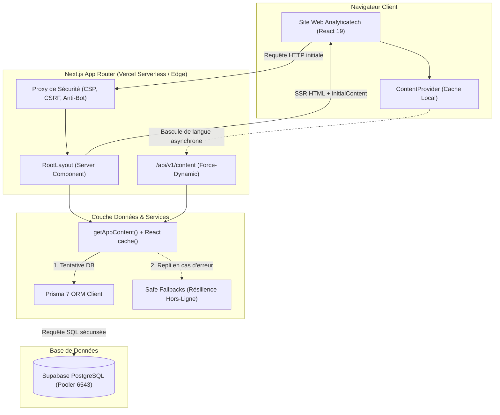

<div align="center">

# ⚡ Analyticatech — Plateforme Web & Vitrine Technologique

**Cabinet de conseil & ingénierie d'élite en Intelligence Artificielle, Systèmes Multi-Agents et Automatisation Industrielle.**

[](https://nextjs.org/)
[](https://react.dev/)
[](https://www.typescriptlang.org/)
[](https://tailwindcss.com/)
[](https://www.prisma.io/)
[](https://supabase.com/)
[](https://vitest.dev/)
[](https://playwright.dev/)
[](https://vercel.com/)

[**analyticatech.fr →**](https://analyticatech.fr)

</div>

---

## 📑 Table des Matières

- [Aperçu & Vision](#-aperçu--vision)
- [Piliers d'Ingénierie & Fonctionnalités](#-piliers-dingénierie--fonctionnalités)
- [Architecture Technique & Flux de Données](#-architecture-technique--flux-de-données)
- [Stack Technologique](#-stack-technologique)
- [Arborescence du Projet](#-arborescence-du-projet)
- [Guide de Démarrage Rapide](#-guide-de-démarrage-rapide)
  - [Prérequis](#prérequis)
  - [Installation](#installation)
  - [Variables d'Environnement](#variables-denvironnement)
  - [Initialisation de la Base de Données](#initialisation-de-la-base-de-données)
  - [Lancement Local](#lancement-local)
- [Scripts & Commandes](#-scripts--commandes)
- [Stratégie de Test & Qualité](#-stratégie-de-test--qualité)
- [Sécurité & Conformité RGPD](#-sécurité--conformité-rgpd)
- [Déploiement en Production](#-déploiement-en-production)
- [Licence](#-licence)

---

## 🎯 Aperçu & Vision

**Analyticatech** conçoit et déploie des infrastructures d'automatisation cognitive et des systèmes d'agents IA autonomes pour les organisations exigeantes.

Cette plateforme web constitue à la fois la **vitrine institutionnelle** de la firme et un **démonstrateur technique en temps réel** de ses standards d'ingénierie :
- **Design Cyberpunk Corporate** : Esthétique soignée, typographie Space Grotesk / Inter / JetBrains Mono, palettes sombres HSL, cartes glassmorphism (`glass-card`, `glass-strong`) et accent `#F26D3D`.
- **Télémétrie en Direct** : Bento Grid de métriques dynamiques avec interpolation, sparklines vectorielles SVG et graphe de flux architectural animé.
- **Résilience Extrême** : Architecture découplée fonctionnant en mode dégradé gracieux (fallbacks hors-ligne instantanés) en cas d'indisponibilité de la base de données.
- **Sécurité Proactive** : Headers CSP stricts, double validation CSRF, filtrage de bots malveillants et hachage IP irréversible conforme RGPD.

---

## ✨ Piliers d'Ingénierie & Fonctionnalités

### 1. Performance Web & Rendu Élite
- **Next.js 16 App Router + React 19** : Architecture Server Components (RSC) native avec SSR complet.
- **Chargement Conditionnel Intelligent (`LazySection`)** : Montage à l'approche par `IntersectionObserver` (marge de 1 000 px) et préchargement idle (~2,5 viewports).
- **Zéro CLS (Cumulative Layout Shift)** : Squelettes de réservation de hauteur (`SectionSkeleton`) synchronisés par breakpoint.
- **Animations Optimisées** : Framer Motion 12 exploitant strictement les propriétés `transform` et `opacity` accélérées par GPU, avec prise en compte de `prefers-reduced-motion`.

### 2. Internationalisation Native (i18n)
- **Bilinguisme Intégral FR / EN** : Détection intelligente (cookie `NEXT_LOCALE` / en-tête `x-locale`) avec bascule instantanée sans rechargement de page.
- **Synchronisation Contextuelle (`ContentProvider`)** : Mise à jour immédiate de tous les textes, métriques et schémas sans divergence d'hydratation.

### 3. Télémétrie & Données Dynamiques
- **Console Bento Temps Réel (`DataConsoleBento`)** : Visualisation des métriques de production (taux de disponibilité, processus automatisés, agents actifs, latence système).
- **Graphe Vivant d'Architecture (`LivingSystemGraph`)** : Représentation interactive du pipeline cognitif (Ingestion → Cortex Agentique → Validation & Sécurité → Actionneurs Métier).

### 4. SEO & Métadonnées Structurées
- **JSON-LD Schema.org** : Schémas `Organization`, `WebSite`, `Service` et `Article` générés dynamiquement.
- **Sitemap & Robots Dynamiques** : Indexation optimisée (`/sitemap.xml`, `/robots.txt`, `/public/llms.txt`).

---

## 🏗 Architecture Technique & Flux de Données



---

## 🛠 Stack Technologique

| Domaine | Technologie | Rôle / Justification |
|---|---|---|
| **Framework** | [Next.js 16 (App Router)](https://nextjs.org/) | SSR, React Server Components, optimisation de build |
| **UI Runtime** | [React 19](https://react.dev/) | Gestion d'état moderne, hooks optimisés, actions |
| **Langage** | [TypeScript 5](https://www.typescriptlang.org/) | Typage statique strict (`strict: true`, `noImplicitAny: true`) |
| **Styling** | [Tailwind CSS v4](https://tailwindcss.com/) | Moteur CSS natif ultra-rapide, variables CSS dynamiques |
| **Animations** | [Framer Motion 12](https://www.framer.com/motion/) | Transitions déclaratives fluides respectant l'accessibilité |
| **ORM** | [Prisma 7](https://www.prisma.io/) | Accès typé à la base de données via pooler `@prisma/adapter-pg` |
| **Base de Données** | [PostgreSQL (Supabase)](https://supabase.com/) | Persistance relationnelle cloud avec RLS et pooler transactionnel |
| **Validation** | [Zod 4](https://zod.dev/) | Schémas de validation runtime pour formulaires et variables |
| **Tests Unitaires** | [Vitest 4](https://vitest.dev/) | Exécution ultra-rapide des tests SSR et composants |
| **Tests E2E** | [Playwright](https://playwright.dev/) | Tests d'intégration et de non-régression end-to-end multi-navigateurs |
| **Emails** | [Resend](https://resend.com/) | Envoi transactionnel des demandes de contact et alertes |
| **Hébergement** | [Vercel](https://vercel.com/) | Déploiement serverless continu avec monitoring Speed Insights |

---

## 📁 Arborescence du Projet

```
Application-web-analyticatech/
├── prisma/
│   ├── schema.prisma              # Schéma de base de données PostgreSQL (35+ modèles)
│   ├── seed.ts                    # Script de population des données initiales harmonisées
│   └── rls.sql                    # Politiques Row Level Security pour Supabase
├── public/
│   ├── images/                    # Assets visuels optimisés (WebP/SVG)
│   ├── llms.txt                   # Manifeste IA pour indexation LLM
│   ├── robots.txt                 # Directives pour moteurs de recherche
│   └── favicon.ico                # Favicon et icônes applicatives
├── src/
│   ├── app/                       # Next.js App Router
│   │   ├── api/                   # Routes API (/api/v1/content, /api/v1/contact, /api/health)
│   │   ├── layout.tsx             # Layout racine (polices, thèmes, injection SSR initialContent)
│   │   ├── page.tsx               # Page d'accueil Server Component
│   │   ├── globals.css            # Feuille de styles globale Tailwind v4 & Design Tokens
│   │   └── sitemap.ts             # Générateur dynamique de sitemap.xml
│   ├── components/
│   │   ├── branding/              # Logo, sélecteurs de thème et langue, consentement RGPD
│   │   ├── effects/               # Backgrounds immersifs et animations d'ambiance
│   │   ├── interactive/           # Compteurs animés, sparklines, graphe d'architecture
│   │   ├── layout/                # SiteShell, Navbar, Footer, BackToTop
│   │   ├── providers/             # ContentProvider, ThemeProvider, I18nProvider
│   │   ├── sections/              # Vues : Home, Services, Solutions, Blog, Contact, Legal
│   │   ├── seo/                   # Injection des balises structurées JSON-LD
│   │   └── ui/                    # Primitives UI (boutons glassmorphism, skeletons, toast)
│   ├── lib/
│   │   ├── content/               # Données de repli (fallbacks) et constantes métier
│   │   ├── db/                    # Client d'accès à la base de données Prisma
│   │   ├── email/                 # Service d'expédition d'emails (Resend / Stub)
│   │   ├── i18n/                  # Gestionnaire de traduction et dictionnaires FR/EN
│   │   ├── observability/         # Journalisation d'audit et métriques de santé
│   │   ├── security/              # Modules CSRF, fingerprinting IP, assainissement XSS, rate-limit
│   │   ├── services/              # Couche d'accès aux données (services, métriques, SEO...)
│   │   └── validation/            # Schémas Zod pour la validation des payloads
│   ├── proxy.ts                   # Middleware de sécurité réseau (CORS, CSP, User-Agent)
│   └── types/                     # Définitions TypeScript partagées
├── e2e/                           # Suites de tests End-to-End Playwright
├── next.config.ts                 # Configuration Next.js (CSP, headers, standalone)
├── package.json                   # Dépendances et scripts de build
├── tsconfig.json                  # Configuration TypeScript stricte
└── vitest.config.ts               # Configuration du banc de tests unitaires Vitest
```

---

## 🚀 Guide de Démarrage Rapide

### Prérequis

- **Node.js** : version `20.x` ou supérieure (`24.x` recommandée)
- **npm** : version `10.x` ou supérieure
- Une instance **PostgreSQL** (Supabase recommandé avec pooler actif)

### Installation

```bash
# 1. Cloner le dépôt
git clone https://github.com/Gninhi/Application-web-analyticatech.git
cd Application-web-analyticatech

# 2. Installer les dépendances
npm install
```

### Variables d'Environnement

Créez un fichier `.env` à la racine en copiant le modèle fourni :

```bash
cp .env.example .env
```

Renseignez les variables nécessaires :

| Variable | Description | Exemple / Valeur par défaut | Obligatoire |
|---|---|---|:---:|
| `DATABASE_URL` | URL PostgreSQL (Transaction Pooler - Port 6543) | `postgresql://...@...pooler.supabase.com:6543/postgres?pgbouncer=true` | ✅ |
| `DIRECT_URL` | URL PostgreSQL Directe (Port 5432 - pour migrations) | `postgresql://...@...pooler.supabase.com:5432/postgres?sslmode=require` | ✅ |
| `DATABASE_SSL` | Activation de la vérification SSL | `true` | ✅ |
| `IP_SALT` | Sel cryptographique hexadécimal (64 car.) pour hachage RGPD | `openssl rand -hex 32` | ✅ |
| `ALLOWED_ORIGINS` | Origines autorisées (CORS / CSRF) | `http://localhost:3000,https://analyticatech.fr` | ✅ |
| `NEXT_PUBLIC_SITE_URL` | URL publique canonique du site | `https://analyticatech.fr` | ✅ |
| `NEXT_PUBLIC_SUPABASE_URL` | URL de l'API Supabase | `https://xxxx.supabase.co` | ✅ |
| `NEXT_PUBLIC_SUPABASE_ANON_KEY`| Clé publique anonyme Supabase | `eyJhbGci...` | ✅ |
| `RESEND_API_KEY` | Clé API pour l'envoi d'emails transactionnels | `re_...` | ⬜ (Mode stub si vide) |
| `MAIL_FROM` | Adresse d'expédition des notifications | `Analyticatech <contact@analyticatech.fr>` | ⬜ |
| `MAIL_TO` | Adresse de réception des leads entrants | `leads@analyticatech.fr` | ⬜ |

### Initialisation de la Base de Données

```bash
# Générer les clients typés Prisma
npm run db:generate

# Synchroniser le schéma avec Supabase
npm run db:push

# Peupler la base avec les données de démonstration et métriques harmonisées
npm run seed
```

### Lancement Local

```bash
# Démarrer le serveur de développement local sur le port 3000
npm run dev
```

Ouvrez [http://localhost:3000](http://localhost:3000) dans votre navigateur.

---

## ⚡ Scripts & Commandes

| Commande | Action |
|---|---|
| `npm run dev` | Lance le serveur de développement Next.js (port 3000) |
| `npm run build` | Compile l'application pour la production (bundle standalone optimisé) |
| `npm start` | Démarre le serveur Node.js en mode production |
| `npm run lint` | Exécute ESLint pour vérifier la conformité du code |
| `npm run typecheck` | Valide le typage statique TypeScript (`tsc --noEmit`) |
| `npm run test:unit` | Exécute les tests unitaires avec Vitest (111 tests) |
| `npm run test:e2e` | Exécute les tests end-to-end avec Playwright (33 tests) |
| `npm test` | Exécute la suite complète de validation (unitaires + e2e) |
| `npm run db:generate` | Génère les artefacts Prisma Client dans `src/generated/prisma` |
| `npm run db:push` | Applique le schéma Prisma directement sur la base de données |
| `npm run seed` | Exécute le script de peuplement `prisma/seed.ts` avec chargement de `.env` |

---

## 🛡 Sécurité & Conformité RGPD

La sécurité de la plateforme repose sur une approche en profondeur à plusieurs niveaux :

1. **Content Security Policy (CSP) Stricte** :
   - Injection dynamique de nonces cryptographiques (`x-nonce`) pour les scripts inline.
   - Interdiction formelle de `unsafe-eval` et restriction des sources de polices et médias.
2. **Protection CSRF & Validation d'Origine** :
   - Vérification systématique de l'en-tête `Origin` / `Referer` sur toutes les routes de mutation.
   - Mécanisme de jeton CSRF en double cookie signé.
3. **Mitigation des Bots & Scrapers** :
   - Analyse dynamique des en-têtes `User-Agent` par rapport à une liste noire de signatures suspectes.
   - Limitation de débit adaptative (*Rate Limiting*) par empreinte client avec stockage résilient.
4. **Anonymisation Conforme RGPD** :
   - Les adresses IP ne sont **jamais stockées en clair**. Elles sont hachées avec un sel cryptographique secret (`IP_SALT` de 32 octets) via HMAC-SHA-256.

---

## 🧪 Stratégie de Test & Qualité

Le projet maintient une couverture de test rigoureuse pour garantir une stabilité totale :

```
✓ Tests Unitaires (Vitest 4) : 111 / 111 tests passés (22 suites de test)
✓ Tests End-to-End (Playwright) : 33 / 33 scénarios validés
✓ Vérification Statique (TypeScript strict) : 0 erreur
✓ Analyse de Code (ESLint 9) : 0 avertissement
```

Pour lancer l'ensemble des vérifications qualité avant toute contribution :

```bash
npm run lint && npm run typecheck && npm run test:unit
```

---

## 🌐 Déploiement en Production

La plateforme est optimisée pour un déploiement continu sur **Vercel** :

1. **Liaison du Dépôt** : Connectez le dépôt GitHub au projet Vercel.
2. **Variables d'Environnement** : Renseignez les variables de production dans l'interface Vercel (*Project Settings → Environment Variables*).
3. **Génération Prisma Automatisée** : Le script `npm run vercel-build` exécute automatiquement `prisma generate && next build`.
4. **Domaine Personnalisé** : Ajoutez le domaine `analyticatech.fr` et activez la redirection automatique `www` vers apex.

---

## 📄 Licence

Propriété intellectuelle exclusive — © **Analyticatech**. Tous droits réservés.
